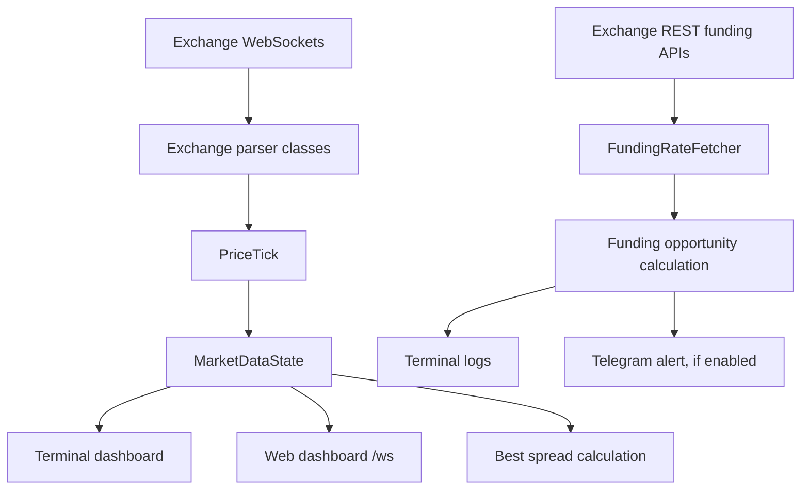

# Technical Audit for ITMO STARS

Project: crypto arbitrage analytics for SOL across Binance, Bybit, and OKX.

Important positioning: this project should be presented as an analytical monitor, not as a guaranteed profit trading bot. The current code does not place orders, does not model full liquidity, and does not calculate all real trading costs.

## 1. Current Project Structure

```text
crypto-arbitrage-bot/
  app/
    main.py                 # application entry point
    config.py               # reads settings from .env
    core/
      market_data.py        # in-memory price storage and spread calculation
    exchanges/
      base.py               # common WebSocket connection/reconnect logic
      binance.py            # Binance futures trade stream parser
      bybit.py              # Bybit linear ticker stream parser
      okx.py                # OKX ticker stream parser
      funding.py            # REST funding-rate fetcher
    web/
      server.py             # aiohttp HTML dashboard + WebSocket endpoint
    display/
      terminal.py           # terminal dashboard
    notifiers/
      telegram.py           # Telegram messages
    risk/
      manager.py            # unused risk-management draft
  scripts/
    check_health.py         # live connectivity health check
  requirements.txt
  .env
  .env.example
```

There is currently no `README.md`, no Dockerfile, no tests, and no Git repository metadata in the opened workspace.

## 2. Entry Point

The entry point is:

```bash
python -m app.main
```

`app/main.py` creates:

- `MarketDataState` for latest market prices;
- `FundingRateFetcher` for funding rates;
- `WebDashboard` on `http://localhost:8080`;
- `DisplayEngine` for terminal output;
- three exchange WebSocket clients: Binance, Bybit, OKX;
- optional Telegram notifier if token and chat id exist in `.env`.

## 3. Data Flow



### Price pipeline

1. Binance/Bybit/OKX clients connect to public market streams.
2. Each client parses exchange-specific JSON.
3. Parser creates `PriceTick(exchange, symbol, price)`.
4. `MarketDataState.update()` saves the latest price.
5. Terminal and web dashboard read latest prices from memory.
6. `get_best_spread()` compares latest prices and returns the largest absolute difference.

### Funding pipeline

1. `FundingRateFetcher.update_all()` calls Binance, Bybit, and OKX REST APIs.
2. Each response is normalized to a funding rate.
3. `get_best_opportunity()` tries to find a long/short pair with the best funding difference.
4. If the opportunity is above threshold, the app prints it and optionally sends Telegram.

## 4. What Is Good Already

From an ITMO STARS commission perspective, the strongest parts are:

- the project works with real external market APIs;
- it uses asynchronous Python, which is relevant for backend/network projects;
- exchange-specific code is separated into modules;
- there is a reusable base WebSocket class;
- there is both terminal output and a web dashboard;
- `.env` is used for configuration;
- Telegram integration exists;
- there is a health-check script for live connectivity.

These are useful points for the defense because they show that the project is not just a static demo.

## 5. Main Technical Problems

| Problem | Criticality | Project improvement | Estimated time | Fix now? |
|---|---:|---:|---:|---|
| `.env.example` contained a real-looking Telegram token and chat id | Critical | Very high | 5 min | Yes, fixed immediately |
| No README | High | Very high | 1-2 h | Yes |
| Algorithm uses `lastPrice` / last trade price instead of bid/ask | High | Very high | 3-6 h | Yes |
| Hardcoded `SOLUSDT` in many files | High | High | 1-2 h | Yes |
| No REST API endpoints, only HTML and WebSocket | Medium | High | 1-2 h | Yes |
| Errors are printed or silently ignored, no structured logging | Medium | High | 1-2 h | Yes |
| `risk/manager.py` is unused and may mislead reviewers | Medium | Medium | 30-60 min | Yes |
| Funding formula is unclear and needs careful explanation | High | High | 2-4 h | Yes |
| No tests for core calculations | High | High | 1-3 h | Yes |
| No Dockerfile | Medium | Medium | 30-60 min | Yes if time |
| Web dashboard is embedded as a huge string in Python | Medium | Medium | 1-2 h | Later if time |
| No graceful cleanup for aiohttp runner in `WebDashboard.stop()` | Medium | Medium | 30-60 min | Yes |
| No stale-data filtering in spread calculation | High | High | 1-2 h | Yes |
| No liquidity/depth/slippage model | High | High | 4-8 h | Partial now |
| No trading fees / withdrawal fees in price opportunity | High | High | 2-4 h | Partial now |
| No distinction between spot, futures, and swaps | High | High | 2-4 h | Yes in docs/code naming |
| No validation for numeric env variables | Medium | Medium | 30-60 min | Yes |
| No API key permissions section | Medium | Medium | 30 min | Yes in README |

## 6. Architecture Review

### Current architecture

The current architecture is simple and understandable:

- `main.py` wires everything together;
- `exchanges/` knows how to connect to each exchange;
- `core/market_data.py` stores prices and calculates spreads;
- `web/server.py` displays data;
- `notifiers/telegram.py` sends messages.

This is a good beginner-friendly base.

### Main weakness

The project does not yet have a clear domain layer for "opportunity calculation".

Right now `MarketDataState` both stores data and decides what the best spread is. At a small scale this works, but for a serious project it is better to separate:

- market data storage;
- opportunity calculation;
- risk/cost model;
- presentation layer.

That separation makes the project easier to explain:

> "The exchange adapters collect normalized market data. The analytics layer calculates opportunities. The web layer only displays already prepared results."

## 7. Arbitrage Logic Review

### Current price-spread logic

The project currently compares latest prices:

```text
spread = price_on_exchange_B - price_on_exchange_A
```

This is not enough for real arbitrage.

Real cross-exchange arbitrage should compare:

```text
buy price = best ask on the cheaper exchange
sell price = best bid on the more expensive exchange
```

Why:

- `lastPrice` is just the last executed trade;
- you cannot necessarily buy or sell at `lastPrice`;
- to buy immediately, you usually pay the best ask;
- to sell immediately, you usually receive the best bid.

### Missing real-world factors

The current code does not fully account for:

- trading fees;
- bid/ask spread;
- order book depth;
- slippage;
- withdrawal fees;
- deposit/withdraw availability;
- transfer time between exchanges;
- stale data;
- minimum order size;
- same ticker meaning different instruments;
- spot vs futures vs perpetual swaps.

For defense, say this clearly:

> "The current version is an analytical monitor. It highlights suspicious price/funding differences. It does not guarantee executable profit because final execution depends on liquidity, fees, transfers, and exchange restrictions."

That honesty is better than pretending it is a production trading system.

## 8. Funding-Rate Logic Review

Funding arbitrage is conceptually different from spot price arbitrage.

Funding-rate strategy usually means:

- open long on one perpetual futures market;
- open short on another perpetual futures market;
- stay roughly market-neutral;
- receive more funding than you pay.

The current project attempts this, but the formula and naming need cleanup. A reviewer may ask:

- When do longs pay funding?
- When do shorts receive funding?
- Are funding intervals equal across exchanges?
- Are next funding times aligned?
- Are taker fees included for opening and closing?
- What about liquidation risk?

The project should present funding opportunities as estimates, not guaranteed profit.

## 9. Security Review

### Critical issue found

`.env.example` contained a real-looking Telegram bot token and chat id. This has been replaced with placeholders.

You should still rotate the Telegram bot token in BotFather because once a token has been stored in a project file, it should be considered leaked.

### Current positives

- `.env` is ignored by `.gitignore`;
- the app reads secrets from environment variables.

### Needed improvements

- never commit `.env`;
- keep `.env.example` with fake values only;
- document token rotation;
- avoid printing secret values;
- for a real trading system, never request withdrawal permissions for exchange API keys.

## 10. FastAPI / REST API Review

The project currently uses `aiohttp`, not FastAPI.

This is acceptable for a small async dashboard, but the user request mentions FastAPI and REST API. For ITMO STARS, FastAPI would make the project more recognizable as a backend project because it gives:

- automatic OpenAPI docs;
- typed request/response models;
- clean REST endpoints;
- easier testing.

However, switching everything to FastAPI is a medium-size rewrite. A pragmatic path:

1. First clean domain logic and tests.
2. Add REST-like JSON endpoints to the current `aiohttp` dashboard.
3. If time remains, migrate web layer to FastAPI.

## 11. Testing Review

There are no automated tests now.

Highest-value tests:

- `MarketDataState` saves latest ticks correctly;
- stale prices are excluded;
- best spread route is calculated correctly;
- funding opportunity direction is correct;
- invalid exchange messages do not crash the app;
- config parsing handles invalid values.

Tests are especially useful for defense because they show engineering maturity.

## 12. Recommended Priority Plan

### Stage 1: Safety and presentation baseline

- fix leaked `.env.example`;
- add `README.md`;
- document that the project is analytics, not guaranteed trading profit;
- add run instructions;
- add architecture/data-flow explanation.

### Stage 2: Core correctness

- replace raw last-price terminology with market snapshot terminology;
- add stale-data filtering;
- centralize symbol config;
- separate opportunity calculation from storage;
- include approximate fees in opportunity output.

### Stage 3: Backend quality

- add JSON API endpoints:
  - `/api/health`;
  - `/api/prices`;
  - `/api/opportunities`;
  - `/api/funding`;
- add structured logging;
- improve graceful shutdown.

### Stage 4: Tests and Docker

- add focused tests for calculations;
- add Dockerfile;
- add `.dockerignore`;
- update health-check instructions.

### Stage 5: UI polish

- move dashboard HTML/CSS/JS out of Python string;
- display bid/ask/funding clearly;
- display stale data warnings;
- display "estimated opportunity" with fees and caveats.

## 13. Defense Questions You Should Be Ready For

1. Why is this not a guaranteed arbitrage bot?
2. Why is bid/ask better than last price?
3. What does funding rate mean?
4. Why use async Python here?
5. How would you add a fourth exchange?
6. Where are secrets stored?
7. What happens if one exchange disconnects?
8. How do you know data is fresh?
9. What risks remain before real trading?
10. Why did you choose simple in-memory state instead of a database?

Short answer for the database question:

> "The current app is a real-time monitor. It only needs the latest state for display and opportunity calculation. A database would be useful for history and backtesting, but it is not necessary for the live MVP."

## 14. Final Audit Verdict

The project has a promising base for a student backend project because it connects to real exchanges, uses async IO, has a dashboard, and has a modular exchange-adapter structure.

The biggest risk is not code style. The biggest risk is overclaiming. If the project is presented as a guaranteed profitable trading bot, the current implementation will not survive technical questions. If it is presented as a real-time crypto market analytics tool that detects possible cross-exchange and funding-rate anomalies, it becomes much more defensible.

The next implementation work should focus on correctness, clarity, tests, README, and honest opportunity scoring.
